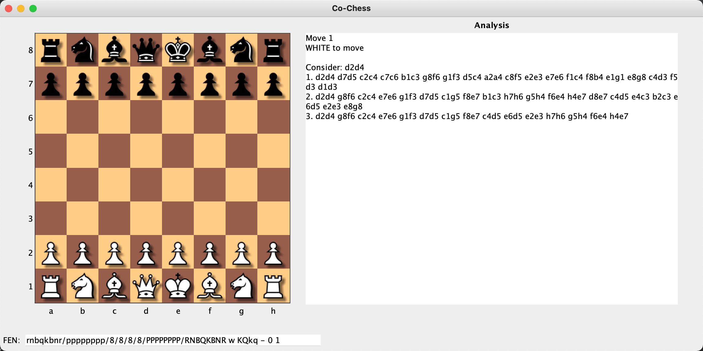
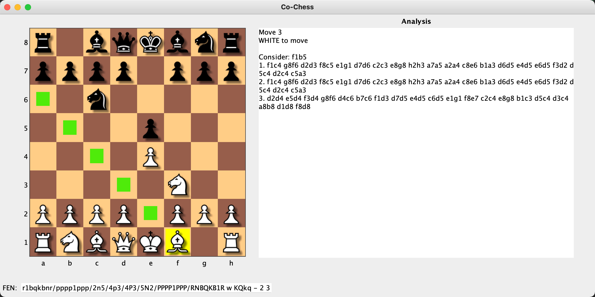

# CoChess

This project 'CoChess' (a deliberate pun on the word 'coaches') forms the beginnings of a program/project that coaches its user into playing better chess.

The project combines the following pieces of earlier work:
- The stockfish chess engine, probably the strongest open source chess engine in the world
- A single class called Stockfish, written by A R Rahul, which provides a Java wrapping of Stockfish 
- A library called [chesslib](https://github.com/bhlangonijr/chesslib), which provides a representation of the chess board and moves
- A chess board display, written by me some time ago as a demonstration of the flexibility of JIDE Charts

When using the program, it assumes you have stockfish installed on your machine, as it
calls out to it as an external process.

On MacOS, you can install stockfish using the command

    brew install stockfish

This installs stockfish as an executable at /usr/local/bin/stockfish. If you are not using a Mac or use a different
installation process and the stockfish executable is installed somewhere else, then for full functionality you will 
need to modify the path given in the class com.chess.cochess.engine.Stockfish. A future version may make this more 
easily configurable.

## Getting the Code

You can retrieve the source for this project as follows:

    $ git clone https://github.com/sawhite/CoChess.git

To prevent a licensing "nag" screen from appearing at start up, you will also need to acquire a license file from the
program author.

## Running the Program

The easiest way of running the program is using [maven](https://maven.apache.org), as follows

    $ cd CoChess
    $ mvn exec:java -Dexec.mainClass=com.chess.cochess.CoChess

On running the program, you should see the following:

Once the user interface is up and running, you can click on a piece. When you do that, the board displays the possible 
legal moves for that piece (if any). For example, the following screenshot shows all the squares to which the selected
bishop can move:

## Program Design

### Separation between presentation and logic
One of the ideas is to separate the presentation from the core chess engine logic. I wanted to have a reasonably nice
looking display of a chess board and was able to get this up and running fairly quickly by adapting some code that I
wrote using my chart component back in 2010. The chess board display would be better written as a custom component - 
and this would be a future refactoring exercise - but the immediate advantage of using the chart is that it gives me 
the ability to easily animate the moves on the board (and also provide shadows for the pieces).

### Keeping the representations apart
The code uses a different representation for the display of the board (the one based on a charting component) to the
one from chesslib that is used for the core logic. I have tried to keep these representations apart, for example by 
using an Observer pattern where necessary, so that the display may later be improved or replaced with minimal disruption
to the core logic.

### Maximize flexibility and building for the future
The analysis part of the display doesn't care what it displays - it only displays some text. The text is prepared by
a 'position reporter' class that can easily be upgraded and improved to give better or more useful information. In 
other words the changes required to improve the analysis display need only occur at a place that is concerned with the
higher level logic of chess concepts. The GUI does not need to change to improve the analysis output.

### Future improvements
Some possible ideas for improvements include:
- Better interactivity for restarting a game, taking back moves, importing or setting up positions, exporting positions
and games;
- Improved analysis to comment on the existence of pins, skewers, threats etc.
- For each legal move, give an indication of its quality (good, bad or OK)

